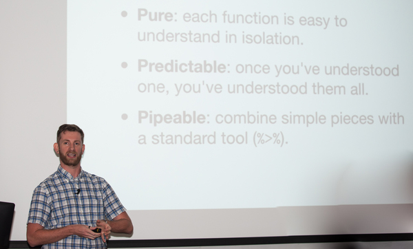

---
title: "Hadley Wickham’s Presentation to Statistical Programming DC"
author: "Sean Warlick"
date: 2015-09-22
--- 
Last Week I had the pleasure to attend a talk given by Hadley Wickham to
the [Statistical Programming DC
Meetup](http://www.meetup.com/stats-prog-dc/). It was great to have
Hadley speak to the group about developing fluent interfaces for R.
While the talk was aimed at using Pure, Predictable and Pipeable
functions to do software (package) development, these ideas can also be
applied to data analysis to create more readable code. In both software
development and data analysis, it is important to create code that is
easy to read for collaboration and reproducibility. As Hadley noted
during the talk, "You always have a collaborator, future you." Applying
the ideas of pure, predictable and pipeable functions to data anlaysis
programming can help achive the goals of reproducibility and easy
collaboration.

  
*Hadley Presenting to SPDC*

### Pure Functions

A pure function is a function where the output only depends on the input
of the fuction and in the case of programming, one which does not change
the global enviroment. These features make pure functions very easy to
understand in isolation. For example, the functions below are all pure
functions and it is easy to understand what each is doing.

    # Some Pure Functions ----
    x + y 
    mean(x)
    lm(y ~ x)

While `read.csv()` and the assignment operator are familar functions,
they are not pure functions. Both of them change the global environment.
When understanding the output of these funcitons, the reader must
understand the state of the global enviroment before the function is
called or the new assignemnt is made. The `rnorm()` function, on the
other hand, is not pure since it depends on more than just the inputs,
it also depends on the system time.

    # Some Impure Functions ----
    read.csv() 
    <- # Assignement operator ----
    rnorm(10)

Obviously it is not possible to perform data analysis comprised of only
pure functions. We need to create objects and store outputs for later
use. Sometimes we need to use an analytical tool that depends on a
random number generator. Still, pure functions should form the
foundation of a data anlysis script. It will be easier for collaborators
to understand and re-use code built around pure functions.

### Predictable

In his talk, Hadely highlighted the importance of creating functions in
a predictible manner. Using consitent naming, punctuation, arguments and
returned object types make code more predictable. The predictability
makes it easy to learn, reproduce, and apply in multiple situations.

Likewise, it is important to use consistent conventions when writing
code for analysis. If standard conventions are used in data analysis,
the code can be understood, which makes the results easier to reproduce.
It is also easier to apply the code to new projects. There are several
suggested styles and best practices for writing R code. I would
recommend [Google's Style
Guide](https://google-styleguide.googlecode.com/svn/trunk/Rguide.xml) or
[Hadley's style recommendations](http://adv-r.had.co.nz/Style.html).
Ultimately, style decisions are an individual or group choice, but
whatever the choice, it should be applied consitently so that the data
anlaysis is predictable.

### Pipeable

The pipe operator `%>%` is a chaining tool brought to R via the
**magrittr** package. It allows a series of functions to be grouped
together in a manner that makes code easy to read and solve complex
problems using a combination of simple functions. Since a function or
package doesn't need to be aware of `%>%` to use it, it can be used with
any function. This improves predictablity across packages, thus
enhancing reproducibility. The pipe operator also makes it easy to run
the same pipeline over and over again.

Until recently I resisted using `%>%` becasue I didn't see the benefit.
However, I've now adopted it into my work flow and have seen several
benefits. I am able to more easily reproduce processes that I frequently
need to run. It has made it much easier for teammates at work who are
not as fluent in R to understand what I am doing in a given analysis.
They can see the process more easily since it flows more easily. The
code below might be translated as taking the data and filtering based on
the given condition, then grouping the data by 2 variables and finally
taking the mean of the fourth variable.

    data %>% 
        filter(variable = condition) %>%
        group_by(variable1, variable2) %>%
        summarize(average = mean(variable4))

In the past I might have written.

    data<-data[variable1 == condition]
    data<-data[, mean(variable4), by = list(variable1, variable2)]

Here the flow is not as obvious and we have used the assignment
operator, so we need to keep track of our data set throughout the
sequence. I'm also using the less predictable syntax of **data.table**,
which is a useful, albeit slightly more obscure, package than **dplyr**
which offers similar tools.

By brining the three ideas of pure, predictable and pipeable funtions
together, it is possible to solve complex problems by linking simple and
understandable building blocks. This has the advantage of making the
code more accessable to collaborators and easy to reproduce in a variety
of situations.
