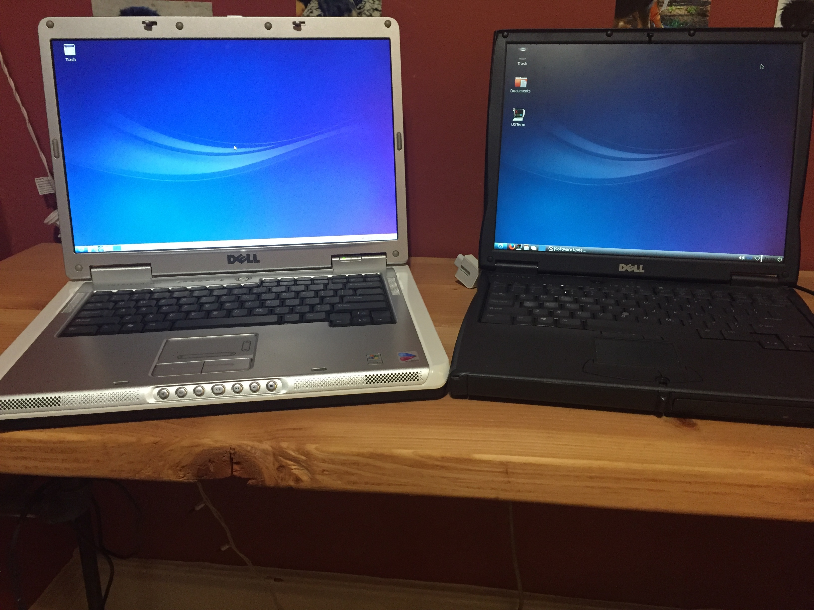
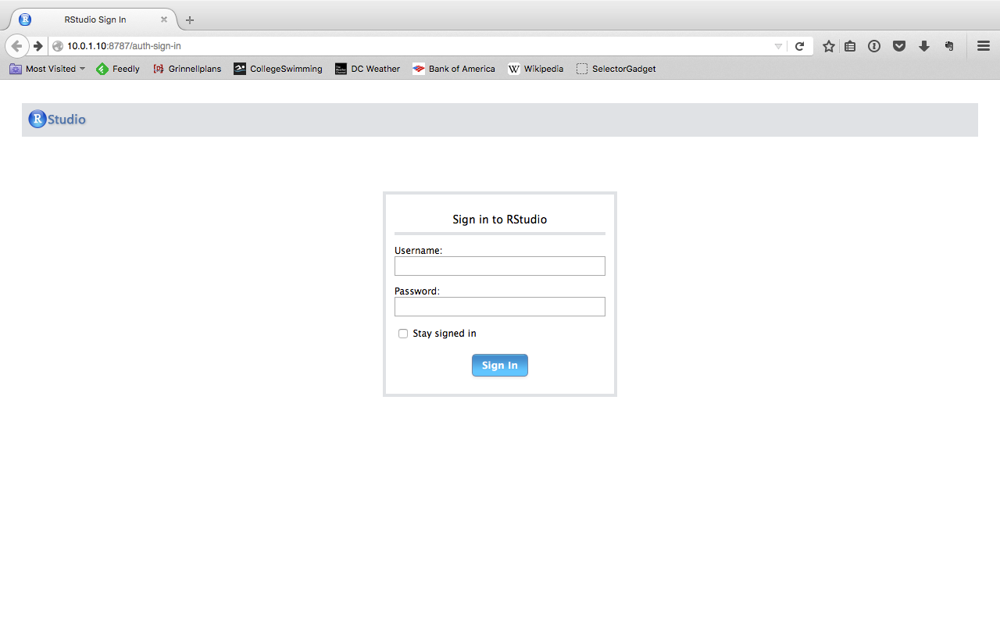
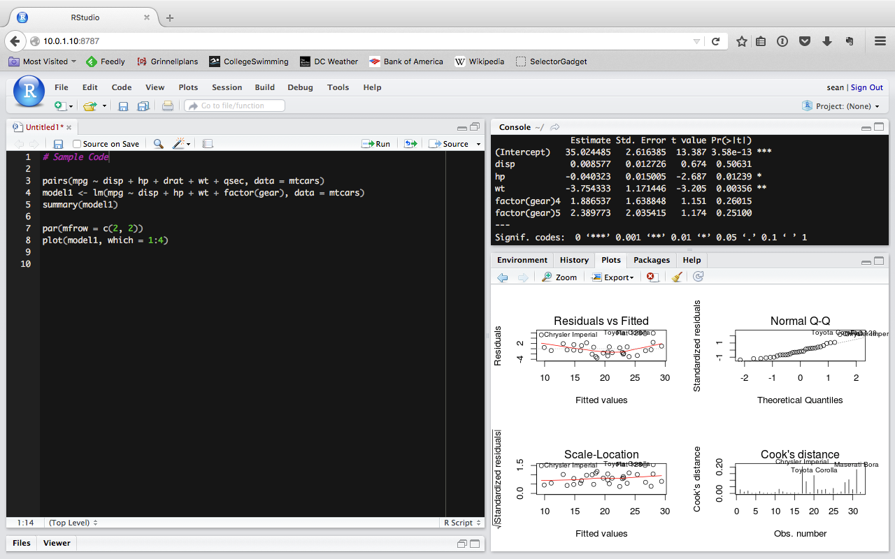

Clean up days in my apartment building netted me two computers that are
perfect for running some basic experiments. The nicer of the two - a
Dell Latitude C640- has a 2.40 GHz processor, 1 Gb of RAM and a 60 GB
hard drive. It's basically an over-sized [Raspbery
Pi](https://www.raspberrypi.org/). Despite the relatively low power the
machine is perfect for learning how to set up an R Studio Server.

#### Getting the Machine Ready

The Dell Latitude still had Windows XP installed, but R Studio only runs
on Linux, so the first thing I did was wipe the hard drive and install a
new operating system. Given the hardware limitations of the machines and
having worked with Ubuntu before, I elected to install
[Lubuntu](http://lubuntu.net). It utilizes the Ubuntu Kernel and the
LDXE desktop.

> **Public Service Announcement:**.  
> Please remember to wipe your hard drive before you get rid of your
> computer! When I booted both laptops, I discovered desktops full of
> files from the previous owners. It's more than likely that sensitive
> personal information was still on the computers.
> [Lifehacker](http://lifehacker.com/5966580/what-should-i-do-to-my-computer-before-i-sell-it)
> has a complete checklist for getting ready to sell or dispose of your
> computer.

Once Lubuntu was installed, I set up Open SSH Server so I could operate
my "server" from my couch via my MacBook Pro. You can install Open SSH
Server with the following command. 

    sudo apt-get install openssh-server

#### Installing R

Lubuntu doesn't come with R already installed, so before setting up R
Studio Server I installed R. When installing R on Linux, the first step
in the installation process is to establish a preferred CRAN mirror to
obtain the most recent version of R for the given Linux distribution.
The install commands below are set up to use the the CRAN mirror at NIH.

    sudo nano /etc/apt/sources.list  

    # Add following code to the file and then save the file: 
     deb https://watson.nci.nih.gov/cran_mirror/bin/linux/ubuntu vivid/

    sudo apt-get install r-base-core

We can now run R interactively at the command line by typing `R` at the
command prompt. It is also possible to run an entire R script in the
terminal by giving it the path to a R script `R path/file_name.R` at the
command prompt.

#### Installing R Studio Server

Now that we have R installed, we can set up the R Studio server. During
the install, you will be prompted to confirm you want to install. Simply
type "y".

    sudo apt-get instal gdebi-core
    wget https://download2.rstudio.org/rstudio-server-0.99.486-i386.deb
    sudo gdebi rstudio-server-0.99.486-i386.deb

Once the download is done, we need to verify the install with the
following command.

    sudo rstudio-server verify-installation

#### Connecting to R Studio

Connecting to R studio server is quite simple, but we need to know the
IP address of the server. We can find this with the `ifconfig` command.
We then type this address into our preferred internet browser, followed
by the R studio's port. By default it is listening for connections on
8787, but this can be changed.

    http://ip-address:8787

When you connect to the server you will be directed to a login page.
Here we'll enter the username and password for the Linux machine. You
can manage users with the typical Linux commands `useradd` and
`userdel`.

Now we are using R on our remote machine. It is just like working with R
on a local machine. The layout can be customized, packages can be
installed and most importantly, analysis can be developed. The one thing
to remember is that all the data and files you will be working with need
to be on the server.

#### Configuring and Managing the Server

The three most important things one should know how to do is start, stop
and reset the server. These tasks are accomplished with fairly
straightforward commands.

    sudo rstudio-server stop
    sudo rstudio-server start
    sudo rstudio-server restart  

For more detailed information on configuring the server you should check
out [R studio's
guides](https://support.rstudio.com/hc/en-us/sections/200150693-RStudio-Server).
If you are running the server on a public network, please take the time
to figure out how to secure the server behind another server.

#### Conclusions

Learning to set up R Studio Server is a great way to learn a number of
important skills. It is a handy way to learn Linux and the command line.
It is also a great way to learn the basics of server administration.
Furthermore, the process here also applies to setting up R Studio Server
on Amazon Web Server or other cloud services.
